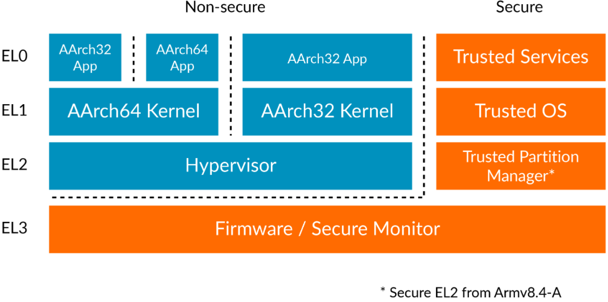
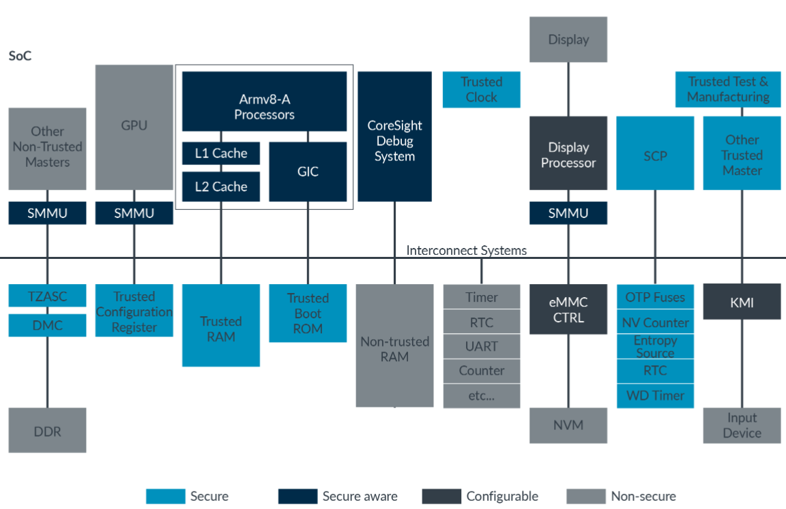
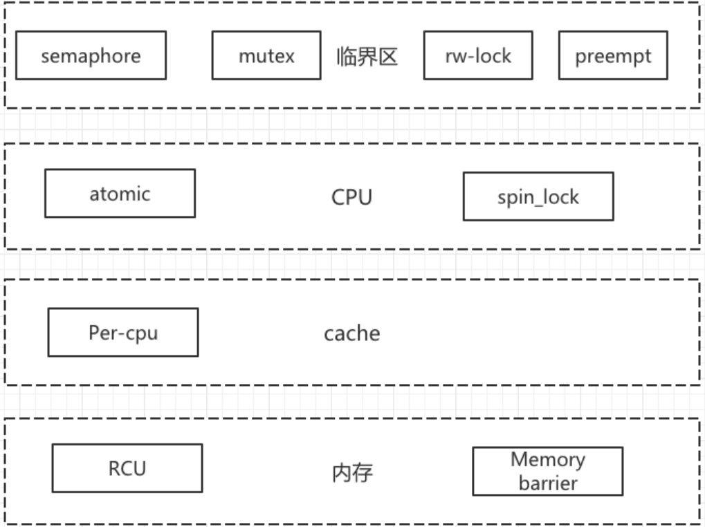
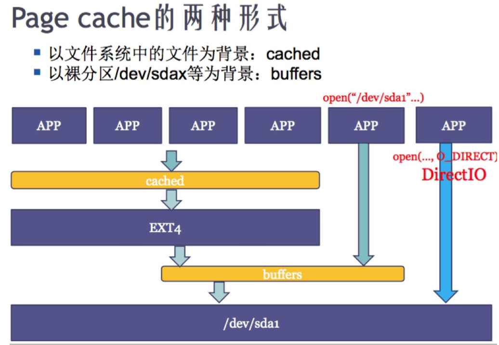
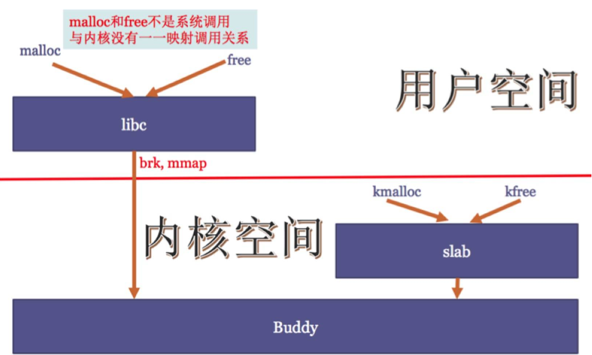

# 项目
## TEE TrustZone 和 Hypervisor

###  TEE TrustZone
总的来说就是将使用硬件将执行环境分为了TEE和REE，两个世界直接通过SMC指令切换或者传递消息    

组件：    
总体上就是在总线上扩充了一位，标注是否是安全世界的状态
必选组件：
AMBA3 AXI总线：安全机制基础设施。
ARMv8A Core El2：虚拟安全和非安全核。
TZASC(TrustZone Address Space Controller)：将内存分成多个区域，每个区域可以单独配置为安全或非安全区域。只能用于内存设备，不能用于块设备。
TZPC(TrustZone Protection Controller)：根据需要控制外设安全特性。
可选组件：
TZMA(TrusztZone Memory Adapter)：将片上RAM和ROM分成不同安全和非安全区域。
AXI-to-APB bridge：桥接APB总线，配合TZPC使APB总线外设支持TrustZone安全特性。

总体切换过程：
REE这边发个消息，写到共享缓冲区中，触发OPTEE驱动进行接下来的处理
1. Rich OS通过FIQ或者SMC异常进入EL3。
2. EL3中执行对应的异常处理函数，并进行SCR_EL3.NS位设置1->0；保存非安全寄存器状态；恢复安全寄存器状态。
3. 从异常处理中退出并将CPU从EL3切换到S.EL1   

切换时的调用过程：

supplicant和另一个东西

optee驱动
### Hypervisor
## 基于 TEE 的内核动态可信技术研究
## 背景
linux下对自身的一些保护机制通常都是在linux内核特权等级下实现的一些保护，但是，如果攻击者拥有了root权限，相当于这些保护方法其实就没有效果了。   
内存中的页表区域的权限一般是可读可写，这就导致如果攻击者有了root权限，它可以任意的篡改页表区域，这样攻击者可以做的事情有：篡改某些关键内存的权限，比如本来是只读的，但是把它修改为读写执行（因为读写权限全是在页表上的），比如设置内核代码段的权限为可写，向内核代码段注入恶意代码；；；在用户态中构造恶意映射内核关键代码和数据的非法页表，进行用户态进程的root提权；；；篡改函数指针，内核权限执行用户代码？    
目前的保护方法分两种：   
软件保护方法：向内核空间加入保护代码，在内核运行时同时执行保护   
1. 内核启动时引入页表权限保护，对代码段和数据段实施**强制只读映射保护**
2. 设置W异或X标志位进行限制，即内存页不能同时具有可写和可执行权限
硬件保护方法：TEE技术


## RKP

## PKM
### 其他
#### static key机制
内核中有很多判断条件在正常情况下的结果都是固定的，除非极其罕见的场景才会改变，通常单个的这种判断的代价很低可以忽略，但是如果这种判断数量巨大且被频繁执行，那就会带来性能损失了。内核的static-key机制就是为了优化这种场景。这个机制会把只读代码段的某些判断指令进行优化，修改为直接跳转向某个确定的分支路径。PKM功能中有对只读代码段的完整性校验，如果开启static-key机制的话，只读代码段的完整性会被破坏。   
NOP指令和jmp指令会互相转换可能，由一个计数来判断该不该跳转这些    
由于没法调试，只能通过log来定位出问题的地方，使用二分法，最终定位到出问题的代码处，发现是一些asm的嵌入汇编语言
## 基于 Hypervisor 的跨域调用安全机制研究

# 实习
## KVM侧的halt pollig性能测试
kvm侧的halt polling是指在虚拟机空闲时，vm exit后，kvm侧会polling一段时间，为了让虚拟机再次被唤醒的时候能立刻运行，但是这个还是会存在vm exit的开销，这个halt polling system节省的是执行调度程序的时间。   
guest侧的halt polling driver相当于在vm exit之前进行polling，这样就不会因虚拟机空闲产生vm exit。   
kvm侧的halt polling：节省了调度的时间。如果host侧有任务的话会立即调度   
guest侧的halt polling：相对于kvm侧的halt polling来说可能更高效，因为不会产生vm exit，但是缺点是，如果host侧有需要运行的任务，guest侧依然会polling
## ARM架构支持capabilities显示vendor等
在src/conf/capabilities.c文件中是输出这个的   
ARM CPU的CPU型号、Vendor、版本等信息存于MIDR_EL1寄存器中，所以直接读取这个寄存器并解析即可
``` C
asm("mrs %0, MIDR_EL1" : "=r" (your_para));
```
mrs和msr指令，读写寄存器，只有MRS和MSR指令可以对状态寄存器CPSR（**程序状态寄存器**）和SPSR（**序状态保存寄存器。SPSR用于保存CPSR的状态**）进行读写操作
## guest侧halt polling
cpuidle core 是 cpuidle framework 的核心模块，负责抽象出 cpuidle device、cpuidle driver 和 cpuidle governor 三个实体，其中cpuidle device是虚拟设备，对应一个CPU，针对每个CPU核都对应一个struct cpuidle_device结构；cpuidle driver是用于驱动一个或多个CPU核；cpu governor用于选择不同的策略   
    
ARM下的WFI WFE指令执行idle，x86下的halt指令   
governor的策略有ladder和menu，ladder是梯度的慢慢进入更省电状态，menu可以选择   
我们的实现是：注册一个cpuidle_driver，然后这个的cpuidle_state添加一个polling再执行default_idle函数（默认的第0个是直接default idle），然后注册一个governor，由它进行选择   
关于怎么执行到idle，那就是0号进程，当当前CPU队列没有任务执行时，就执行idle
## 其他
### KVM和qemu
kvm是内核模块，可以将物理cpu虚拟化为vcpu，但是它并不能虚拟化I/O等。单靠内核中的kvm模块并不能启动一台虚拟机，其只能模拟vcpu,vmemory, 像io设备的模拟还需要借助用户空间程序qemu    
### Linux transparent huge pages (THP)透明大页
在 Linux 操作系统上运行内存需求量较大的应用程序时，由于其采用的默认页面大小为 4KB，因而将会产生较多 TLB Miss 和缺页中断，从而大大影响应用程序的性能。当操作系统以 2MB 甚至更大作为分页的单位时，将会大大减少 TLB Miss 和缺页中断的数量，显著提高应用程序的性能。这也正是 Linux 内核引入大页面支持的直接原因。好处是很明显的，假设应用程序需要 2MB 的内存，如果操作系统以 4KB 作为分页的单位，则需要 512 个页面，进而在 TLB 中需要 512 个表项，同时也需要 512 个页表项，操作系统需要经历至少 512 次 TLB Miss 和 512 次缺页中断才能将 2MB 应用程序空间全部映射到物理内存。然而，当操作系统采用 2MB 作为分页的基本单位时，只需要一次 TLB Miss 和一次缺页中断，就可以为 2MB 的应用程序空间建立虚实映射，并在运行过程中无需再经历 TLB Miss 和缺页中断（假设未发生 TLB 项替换和 Swap）。   
为了能以最小的代价实现大页面支持，Linux 操作系统采用了基于 hugetlbfs 特殊文件系统 2M 字节大页面支持。这种采用特殊文件系统形式支持大页面的方式，使得应用程序可以根据需要灵活地选择虚存页面大小，而不会被强制使用 2MB 大页面。
### DMA和IOMMU
出现DMA的原因：设备向内存复制数据都需要经过CPU的话，太浪费CPU的性能了。   
同步DMA：DMA操作由软件发起，一般流程是设备驱动设置好需要被DMA访问的内存地址后，通过写寄存器通知设备发起DMA操作。比如，播放音频时，驱动将该音频存的地址告知声卡，设备从内存读取数据并播放，播放完成后中断通知驱动   
异步DMA：DMA操作由设备发起。比如网卡，网卡收到的数据直接复制到驱动设置的内存地址去，中断形式通知网络数据包的到来。   
DMA操作的是物理地址，所以，虚拟化情况下可能会受到攻击，所以出现了IOMMU。
### MMIO和port I/O
就是设备的独立编址和统一编址   
Port I/O：使用IO端口访问设备，IN OUT指令等   
MMIO：通过内存访问形式访问设备寄存器或设备RAM
### 使用free命令或者cat /proc/meminfo显示的内存比实际分配的小
free或者是cat /proc/meminfo看到的总内存是伙伴系统可以管理的所有内存的总和，也就是操作系统起来后可供内核或者内核模块以及应用程序分配的内存总和，它不包括BIOS预留的作为特殊用途的内存，也不包括内核代码、为kdump预留， 管理内存页的元数据（struct page）等内存，虽然这些内存不可见，但却是实实在在被虚拟机使用了

### 一些命令
```Shell
lscpu  ##cpu情况
lsmod ##查看mod安装情况
free ##查看磁盘
top ## cpu利用率，，，，按1可以看各CPU单独利用率
df -hl  ##文件系统占用空间， -hl使用
du -hl --max-depth=1 ##查看占用磁盘空间
ifconfig 
cat /proc/cmdline
cat /proc/version ## 查看linux版本
/proc/cpuinfo ##cpu的信息
/sys/modules ##模块
perf stat -e 'kvm:*' -a sleep 10 ##kvm 10秒钟状态
systemctl ## start restart enable disable status
gdb
systemtap ##后面需要看看

###########一些virsh命令
visrsh define wfs.xml #定义
virsh start wfs  #启动
virsh list   #查看列表           --all 查看所有的
virsh dominfo wfs  #显示虚拟机信息
virsh console wfs    #通过控制窗口登录虚拟机   exit退出之后   “ctrl+]”  退出
```
### 扩充虚拟机根分区
如果可以使用pvs pvcreate这些命令最好，但是我的虚拟机不能连接外网下载lvm2包，而离线安装又太麻烦
```Shell
qemu-img resize centos-8.3-arm64-uefi.qcow2 +50G   ##扩容qcow2
qemu-img info centos-8.3-arm64-uefi.qcow2   ##查看扩容情况
# 创建虚拟机，进入虚拟机
fdisk -l #查看硬盘情况
fdisk /dev/sda   #想要扩容的分区   d  n  w （删除分区，创建新分区，同步）
reboot
resize2fs /dev/sda2  
df -h  #查看，根分区已经扩容成功
```
# Linux
## CPU缓存
出现目的：解决CPU和内存之间速度不匹配   
一般一个缓存行大小是64字节   
缓存的意义满足以下原理：**时间局部性原理**和**空间局部性原理**   
三级缓存：L1、L2、L3   L1分为l1i和l1d，指令和数据分开，l3缓存是所有CPU共享的   
**MESI协议** 修改 独占 共享 无效      
MESI保证了一致性，但是需要对状态进行更改，消息传递需要时间。比如修改了本地缓存，那么必须把I状态传递给其他拥有该缓存数据的CPU并等待确认，这个过程会阻塞CPU，影响性能。所以引入了**存储缓存**和**无效队列**   
**存储缓存**：异步处理，用一个buffer，先把值写到buffer中，再发送信号，等确认后再应用到cache中   
**无效队列**：接受端 CPU 接受到 Invalidate 信号后如果立即采取相应行动(去其它 CPU 同步值)，再返回响应信号，则时钟周期也太长了，此处也可优化。接受端 CPU 接受到信号后不是立即采取行动，而是将 Invalidate 信号插入到一个队列 Queue 中，立即作出响应。等到合适的时机，再去处理这个 Queue 中的 Invalidate 信号，并作相应处理

乱序执行
## IO与网络模型
   
**原子变量** 多核竞争数据总线时    
**自旋锁** 循环，适用于很快能获得处理器资源的任务，不能用在中断上下文中    
**互斥锁** 同一时刻只有一个线程进入临界区，其他的休眠    
**信号量** 保护有限数量的临界资源，使用自旋锁保护   
**读写锁** 减小加锁粒度，读写分别加锁，优化了读大于写的场景   
**preempt抢占** 时间片用完后调用schedule、IO等原因自己调用schedule、当前进程被其他进程替换   
**per-cpu变量** linux为解决cpu 各自使用的L2 cache 数据与内存中的不一致的问题，，，per-CPU变量是linux系统一个非常有趣的特性，它为系统中的每个处理器都分配了该变量的副本。这样做的好处是，在多处理器系统中，当处理器操作属于它的变量副本时，不需要考虑与其他处理器的竞争的问题，同时该副本还可以充分利用处理器本地的硬件缓冲cache来提供访问速度。   
**RCU机制** 解决多个CPU同时读写共享数据的场景，，，，**随意读，但更新数据的时候，需要先复制一份副本，在副本上完成修改，再一次性地替换旧数据**   
**内存屏障** 程序运行过程中，对内存访问不一定按照代码编写的顺序来进行,,,读rmd()，，，写wmb()，，，既读又写md()
### I/O与网络模型
1. 阻塞&非阻塞
2. 多路复用
3. Signal IO
4. 异步IO
5. libvemt：事件驱动，如果事件发生，进行回调
1、4更适合块设备，2.3更适合字符设备   
      
为什么硬盘没有所谓的 多路复用，libevent，signal IO？   
因为select(串口), epoll（socket） 这些都是在监听事件，所以各种各样的IO模型，更多是描述字符设备和网络socket的问题。但硬盘的文件，只有读写，没有 epoll这些。 这些IO模型更多是在字符设备，网络socket的场景。

## Linux启动过程
### 改变
划分内核态和用户态   
实模式 ———>  保护模式
### 过程
1. 按下电源
2. 主板启动CPU，CPU重置所有寄存器数据，并设置初始化数据
3. 实模式下，**段选择子+偏移量**的方式到bios（**有中断向量表和中断服务例程**）
4. 通过bios的中断向量表和中断服务例程，加载BootLoader(比如grub2)，加载的内核是gurb的内核
5. 在解压缩真正的内核之前，head.S实现实模式->保护模式，cli关中断先，创建分页机制，初始化内核临时页表。。。
6. 创建0号进程（唯一一个没有通过 fork 或者 kernel_thread产生的进程，采用了gcc的结构体初始化方式为其进行了直接赋值生成），0号进程用于包括内存、页表、必要数据结构、信号、调度器、硬件设备等的初始化。然后生成1号进程和2号进程，最后退化为idle进程。，，，中断初始化、内存初始化、调度初始化、res_init(区分内核态用户态，初始化1、2号进程)


### 0号进程、1号进程、2号进程
**0号**：init_task()，初始化任务，退化为idle进程。   
**1号**：kernel_init()内核线程最后通过execve系统调用转化为init进程（内核态->用户态 系统调用，search_binary_elf，start_thread,在syscall保存现场那里，将CS设置为__USER_CS，DS设置为__USER_DS），，，，**1号进程是所有用户进程的祖先**     
**2号**：kthreadd内核线程调度其他内核线程，，，，**所有内核线程直接或间接以2号线程为父**
### bootloader和bios
BIOS初始化硬件工作状态为主    
BootLoader是为了启动系统而设计的载入程序，是系统加电后运行的第一段软件代码   
现在可以没有BIOS，但是不能没有bootloader，很多专用设备上，只有bootloader没有bios，比如手机
### IDT和GDT
GDT：在系统中唯一的存放段寄存器内容（段描述符）的数组，配合程序进行保护模式下的段寻址。它在操作系统的进程切换中具有重要意义，可理解为所有进程的总目录表，其中存放每一个任务（task）局部描述符表（LDT, Local Descriptor Table）地址和任务状态段（TSS, Task Structure Segment）地址，完成进程中各段的寻址、现场保护与现场恢复。   
IDT：IDT（Interrupt Descriptor Table，中断描述符表），保存保护模式下所有中断服务程序的入口地址，类似于实模式下的中断向量表。IDTR（IDT基地址寄存器），保存IDT的起始地址。   
由IDT知32位中断和16位中断的一个区别是：16位使用中断向量表，位置固定在0x0000处，而32位中断可以在内存任何位置，使用一个基址寄存器指示其位置
### CR0、CR1、CR2、CR3、CR4寄存器   
CR0：控制CPU的寄存器，比如保护模式、分页等   
CR1：未定义，未来使用   
CR2：页故障线性地址寄存器，记录最后一次出现页故障的线性地址（ARM下的MMU中有两个寄存器c5[FSR]和c6[FAR]，分别记录失效状态和失效地址）   
CR3：页目录基址寄存器，，，低12位总是0（因为是4KB页），即使有内容也会被忽略，可不可以利用一下
CR4：Pentium系列（包括486的后期版本）处理器中才实现，它处理的事务包括诸如何时启用虚拟8086模式等
## 内存管理
### 内存分页
一旦开启了MMU，CPU中就只认识虚拟地址了，MMU才能看到物理地址   
为了解决CPU和内存页表之间的速度不匹配问题，出现了TLB   
页表中除了记录偏移之外，还记录了：**RWX权限（这一页的）**和**kernel/user+kernel权限**   
出现page_fault：**根据MMU找不到对应的物理地址**或者**访问权限不对**   
intel的meltdown漏洞，可以允许在用户态访问内核态的内容
页表在内存中   
### 内存分zone
32位zone_DMA、zone_NORMAL和zone_HIGH，而64位没有zone_HIGH，原因在于在32位中highmem部分不能直接访问到，所以办法就是从mormal区域借用空间建立映射访问，不用时再归还，但是64位下，可以访问的到，所以就没有highmem了   
分zone_DMA的原因是，DMA可能无法访问到全部内存,zone_DMA大小是由硬件决定的
### 硬件层的内存管理-buddy
每个**zone**都会使用buddy算法，把空闲页按2的n次方进行管理   
可以使用以下命令 cat /proc/buddyinfo 查看每个zone页分配情况   

buddy算法会导致内存碎片：（谁需要使用连续空闲内存？ **DMA**）
1. 一般方法：reserved内存
2. CMA（连续内存分配器）要搞清楚CMA的真正房东是那些需要连续内存的DMA，其他的人都只是租客。DMA要住的时候，租客必须走。哪个房东会把房子租给一辈子都不准备走的人？内核绝大多数情况下的内存申请，都是无法走的。应用走起来很容易，改下页面就行了。所以主要是APP和文件的page cache的内存，才可以在CMA区域拿。
### 文件页和匿名页
文件页：有文件背景的页面，比如代码段、read/wirte方法读写的文件、mmap方法读写的文件，，，，，**它们有对应的硬盘文件**，如果要交换，可以直接和硬盘文件交换   
匿名页：没有文件背景，比如Stack、Heap、CoW后的数据段(数据段，在未写过时，有文件背景。在写过之后，变成没有文件背景，就被当作匿名页。linux把swap分区，当作匿名页的文件背景。)等，，，，**他们没有对应的硬盘文件**，如果要交换，只能交换到虚拟内存swapfile或linux的swap硬盘分区  
内核通过两种方式打开硬盘文件，任何时候打开文件，Linux会申请一个page cache，把文件读到page cache中    


Linux读写文件有两种方式：**read/writer**和**mmap**    
read/wrie：read把内核空间的page cache往用户空间拷贝，write把用户空间的buffer拷贝到page cache中    
mmap：避免了内核空间和用户空间之间互相拷贝的过程，直接把文件映射成一个虚拟地址指针，指向linux内核申请的page cache

### 内存回收
两种方法：**kswapd和direct reclaim**   
后台慢慢回收：通过kswapd进程，回收到高水位(high)时，才停止回收。从low -> high   
直接回收：当水位达到min水位，会在两种页面同时进行回收，回收比例通过swappiness越大，越倾向于回收匿名页；swappiness越小，越倾向于回收file-backed的页面。当然，它们的回收方法都是一样的LRU算法
### 嵌入式系统的zRAM
zRAM: 用内存来做swap分区。从内存中开辟一小段出来，模拟成硬盘分区，做交换分区，交换匿名页，自带透明压缩功能。当应用程序往zRAM写数据时，会自动把匿名页进行压缩。当应用程序访问匿名页时，内存页表里不命中，发生page fault（major）。从zRAM中把匿名页透明解压出来，还到内存。
### free命令中cached和buffers的区别
page cache：文件系统的缓存，缓存页，如果直接往文件写，写到page cache中，，，**用LRU算法替换**   
buffer cache：块设备的缓存，如果使用dd等工具写磁盘，写到buffer cache中  
Free中的buffer和cache （它们都是占用内存）基于内存的   
buffer ：作为buffer cache的内存，是块设备的读写缓冲区    
cache：作为page cache的内存， 文件系统的cache  
cache这个词，往往意味着它所存储的信息是副本。cache中的数据即使丢失了，也可以从内存中找到原始数据（不考虑脏数据的情况），cache存在的意义是加速查找。   
但是buffer更像是蓄水池，你可以理解成它是一个收作业的课代表，课代表会把所有同学的作业都收集齐以后再一次性地交到老师那里。buffer中的数据没有副本，一旦丢失就彻底丢失了。store buffer也是同样的道理，它会收集多次写操作，然后在合适的时机进行提交。   
   
buffers/cache都是文件系统的缓存，当访问ext3/ext4,fat等文件系统中的文件，产生cache。当直接访问裸分区（/dev/sdax）时，产生buffer。访问裸分区的用户，主要是应用程序直接打开 or 文件系统本身。dd命令 or 硬盘备份 or sd卡，会访问裸分区，产生的缓存就是buffer。而ext4文件系统把硬盘当作裸分区。
**cached是cpu与内存间的，buffer是内存与磁盘间的，都是为了解决速度不对等的问题**
### 内存的动态申请和释放
slab就相当于buddy的一个二级管理器，buddy将内存以2的n次方进行管理，slab管理的内存来自于buddy，，，buddy是把内存条分成多个Zone来管理分配，slab是把从buddy拿到的内存，进行管理分配

如上图：**slab申请和分配的都只针对内核空间**，与用户空间无关，用户空间用libc的库，，，相当于从底向上的过程是：buddy管理zone，slab对buddy内存进行管理，然后kmalloc和kfree使用   
kmalloc和vmalloc：   
1. kmalloc分配的内存物理上连续，虚拟地址空间也连续，，，而vmalloc分配的内存虚拟地址空间连续，物理地址可以不连续
2. kmalloc分配的内存不需要修改页表，而vmalloc分配的内存需要分配页表（可能只限于32位下？因为一般是DMA才需要连续物理空间，因为设备不了解内存分布，，DMA分配的那个区域不需要修改页表？线性映射？）
3. kmalloc可分配的内存空间较小，比较快，，，，vmalloc可分配的内存空间较大，比较慢
4. kmalloc对应于kfree，vmalloc对应于vfree
5. kmalloc分配内存是基于slab，因此slab的一些特性包括着色，对齐等都具备，性能较好      
kmalloc和vmalloc申请的是内核空间的内存，申请完就拿到了，，但是用户空间的malloc，申请完并没有拿到，写的时候才修改页表这些。   

brk和mmap系统调用（这俩是用户空间使用**malloc**分配内存方式）：brk是将数据段(.data)的最高地址指针_edata往高地址推，，，，mmap是在进程的虚拟地址空间中（堆和栈中间，称为文件映射区域的地方）找一块空闲的虚拟内存，，，，malloc一般在分配大于128K的内存时才会使用mmap（原因是，mmap用的时候要缺页异常这些，浪费CPU资源）
### 内存OOM（内存溢出）
当真正的需要写内存的时候，但是并不能拿到真实的内存，就会启动OOM打分机制，耗费内存越多，打分越高，当内存耗尽，就会kill掉OOM打分最高的那个进程
### 进程的内存消耗和泄露
task_struct里的mm_struct指向这个进程所拥有的vm_area_struct    
page_fault的几种可能：
1. 写只读页表
2. 内存访问落在非法区
3. 写代码段、执行代码段   
minor和major缺页：区别是**申请内存时，是否需要读硬盘**比如执行代码段的内容，产生缺页，需要从硬盘读取代码段的内容，则是major缺页，，，而malloc的内存，没有产生IO行为，则是minor中断
## 进程管理

## 文件系统

## 网络协议栈

## 设备驱动
# 面经
# 算法
# 其他
## 关于递归页表
在内存中，如果想要更改某个内存的内容，那么就得通过页表查询访问这块内存，那么如果想要修改这块内存的页表所在的内存的内容呢？也就是对页表进行修改呢？一般情况下就得通过查页表获取页表所在的内存地址，这样就太麻烦了，递归页表可以做到快速查询并修改
在bao hypervisor中遇到的，比如在PDG的第512项（也就是最后一项）的entry设置为指向自己，那么就可以进行递归查询。   